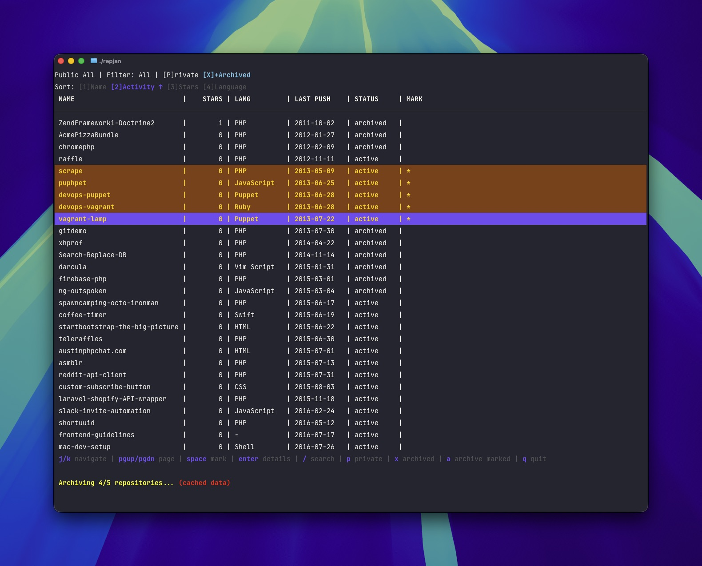

# repjan

A terminal user interface (TUI) tool for managing GitHub repositories at scale. Visualize, filter, and batch archive repositories with optional AI-powered analysis via Fabric.

## Features

- **Visual Dashboard** - Interactive TUI showing all repositories with status indicators
- **Smart Filtering** - Filter by age, stars, forks, language, visibility
- **Archive Detection** - Automatically identifies archive candidates based on heuristics
- **Batch Operations** - Mark and archive multiple repositories at once
- **Search** - Real-time search filtering by repository name
- **Export** - Export marked repositories to JSON for documentation



## Installation

### Prerequisites

- Go 1.21+
- [GitHub CLI](https://cli.github.com/) (`gh`) installed and authenticated

### Build from source

```bash
git clone https://github.com/llbbl/repjan.git
cd repjan
go build -o repjan ./cmd/repjan
```

## Usage

```bash
# Audit your own repositories
repjan

# Audit an organization
repjan --owner acme-corp

```

## Keyboard Controls

### Navigation
| Key | Action |
|-----|--------|
| `j` / `k` / `↑` / `↓` | Navigate list |
| `g` / `G` | Go to top / bottom |
| `/` | Search by name |
| `Enter` | View repository details |
| `q` | Quit |
| `?` | Show help |

### Filtering
| Key | Action |
|-----|--------|
| `a` | Show all repositories |
| `o` | Show old (365+ days inactive) |
| `n` | Show no stars |
| `f` | Show forks only |
| `l` | Filter by language |
| `p` | Show private only |

### Sorting
| Key | Action |
|-----|--------|
| `1` | Sort by name |
| `2` | Sort by activity |
| `3` | Sort by stars |
| `4` | Sort by language |

### Actions
| Key | Action |
|-----|--------|
| `Space` | Mark/unmark for archiving |
| `Shift+A` | Mark all visible |
| `Shift+U` | Unmark all |
| `a` | Archive marked repos (when marked) |
| `e` | Export marked to JSON |

## Archive Candidate Heuristics

Repositories are flagged as archive candidates based on:

- **Age**: No activity in 1+ years (or 2+ years)
- **Engagement**: Zero stars and zero forks
- **Fork Status**: Stale forks (180+ days inactive)
- **Language**: Legacy language + inactivity (PHP, CoffeeScript, Perl, etc.)

## Status Indicators

| Icon | Status |
|------|--------|
| `●` (green) | Active repository |
| `⚠` (yellow) | Archive candidate |
| `□` (gray) | Already archived |

## Export Format

Exported JSON includes:

```json
{
  "exported_at": "2026-01-28T10:30:00Z",
  "owner": "username",
  "total_marked": 12,
  "repositories": [
    {
      "name": "old-repo",
      "full_name": "username/old-repo",
      "stars": 0,
      "forks": 0,
      "days_since_activity": 823,
      "reason": "No activity in 2+ years; No community engagement",
      "language": "PHP",
      "last_push": "2023-02-15T12:00:00Z",
      "is_fork": false,
      "is_private": false
    }
  ]
}
```

## License

[FSL-1.1-MIT](LICENSE.md) - Functional Source License with MIT future license.

Copyright 2026 Logan Lindquist Land
